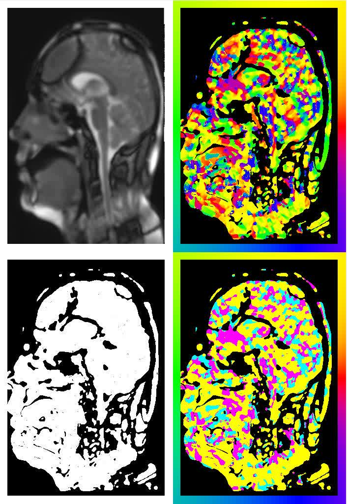

# Compilation
    I am using a branch of halide which can be found here https://github.com/halide/Halide/tree/auto_scheduler
    Open MATLAB and run: compileMcgmHalide.m
# Run
    runMcgmOpticalFlow.m to compile and see the error

# Results
    
    
