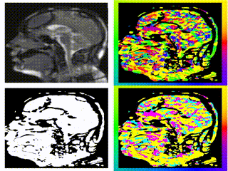

# Compilation
    I am using a branch of halide which can be found here https://github.com/halide/Halide/tree/auto_scheduler
    Open MATLAB and run: compileMcgmHalide.m
# Run
    runMcgmOpticalFlow.m to run demo of the program

# Results

Currently, there are differences between results after automatic and manual scheduling ( illustrated in Figure 1 and Figure 2 ). It seems that error only happens at rows with index larger than the number of columns. It might give a clue to explain why it happens.

1. Figure 1: Video results of Automatically scheduled McGM

2. Figure 2: Video results of Manually schedule McGM

# To-do:

1. Fix the above problem
